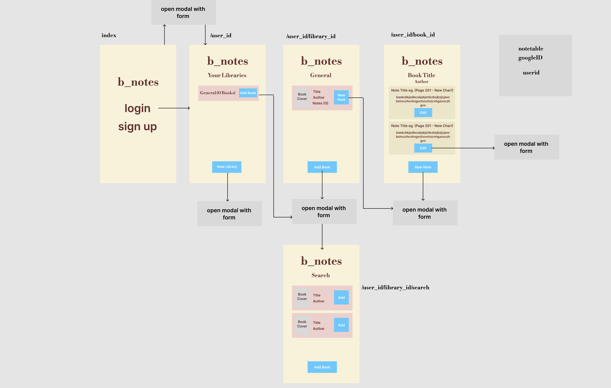
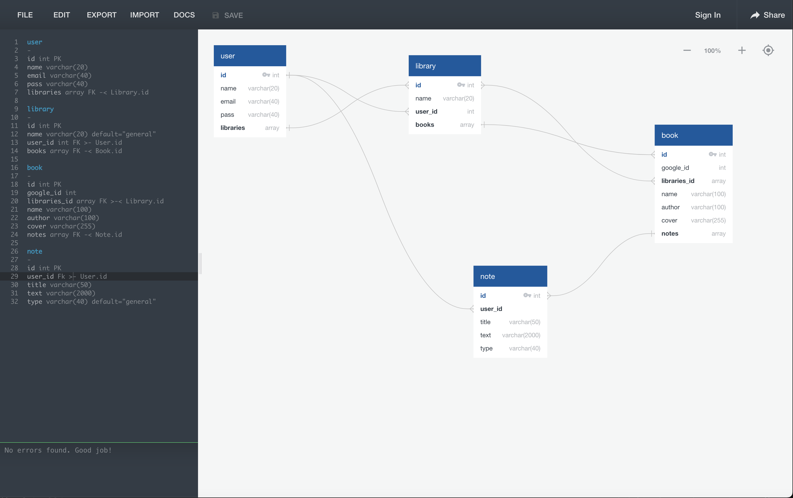
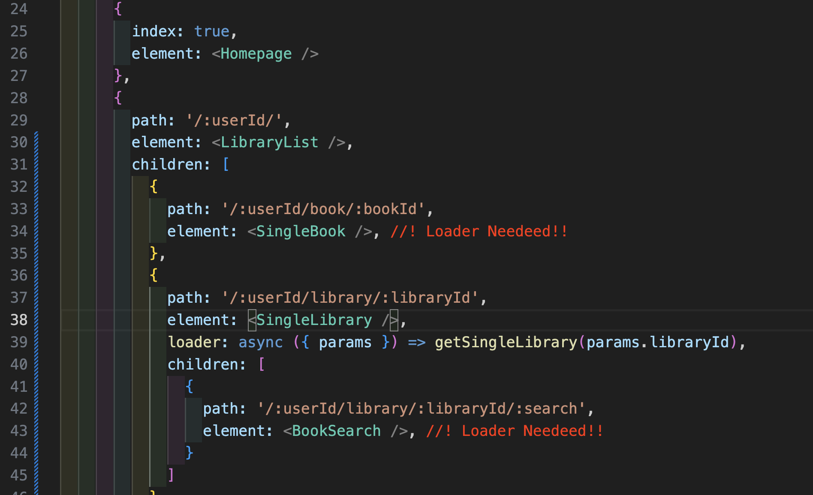
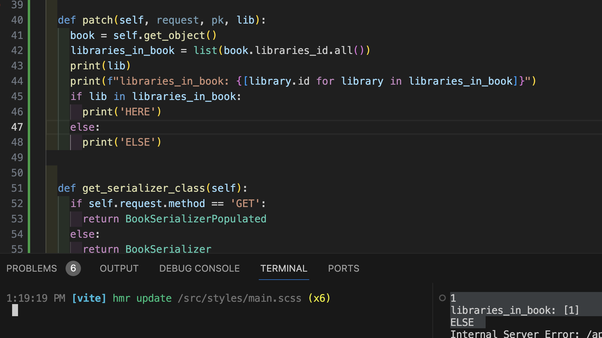

# b_notes(General Assembly SEI Project 4)

[bNotes]: https://b-notes-0900296b98d5.herokuapp.com//
[githubrepo]: https://github.com/Nemomain/SEI-4-b_notes

## Timeframe
7 days, worked by myself.

## Technologies used
* React / JavaScript
* React Router DOM
* HTML5
* SASS
* React Bootstrap
* MUI
* Git
* GitHub
* Axios
* Python/django
* django-environ
* Psycopg
* Vite
* JSON
* Pylint
* JWT
* Bearer Tokens
* npm
* Dotenv
* Simple JWT
* jwt-decode
* PostgreSQL

## [b_notes][bNotes] - Fullstack App
## [b_notes Repository][githubrepo] - Application Repository

<!-- links where to find -->

## Project Description
The only thing I knew from the start is that I wanted to do something useful, no matter how marginally, to me or the people around me. 

b_notes started when I realised that I know a lot of readers, and some didn’t take notes on the pages of their books to not ruin them, so I knew that building an app for readers who want to take notes elsewhere might be a good idea.

In essence, b_notes allows a user to create libraries, to search books, to add books to the libraries, and to take notes about each book. It also allows user library management in adding a particular book to several libraries, maintaining the notes no matter from which it is accessed. And finally, notes can be modified or erased to the user’s discretion.

## Istallation

If you want to run this locally, in the project directory run:
```
pipenv install django
```
```
pipenv shell
```
```
pip install pylint psycopg2-binary djangorestframework djangorestframework-simplejwt django-environ
```

In the directory bnotes_client run:
```
npm install axios react-bootstrap jwt-decode react-router-dom sass
```

After installation run in the project directory:
```
python3 manage.py runserver
```

And in bnotes_client:
```
npm run dev
```

You might have to also define your own env variables!


## Project briefing
The brief we were handed specified the following:

```
#  Project #4: A Django + React App


## Overview


**You've come a long way, and it's time to show it.** This will be your final project and is an opportunity to re cap and cement many of the topics we have covered in the last 11 weeks.


**Remember:** simple code is stable code, so always favour refactoring and bug fixing over adding more functionality.


With this in mind, you need to be smart about how you plan, limit your project scope to be achievable (in terms of functionality) and focus on quality rather than quantity.


Make sure you review your project proposal with your instructor so you can make sure it's **something you can accomplish in the limited time we have**. You will have some time after the project to add extra functionality before showcasing to prospective employers!


---


## Technical Requirements


You must:


* **Build a full-stack application** by making your own backend and your own front-end
* **Use a Python Django API** using Django REST Framework to serve your data from a Postgres database
* **Consume your API with a separate front-end** built with React
* **Be a complete product** which most likely means multiple relationships and CRUD functionality for at least a couple of models
* **Complex Functionality** like integrating a 3rd party API or using a particularly complex React Component would mean that the CRUD and multiple relationships requirement can be relaxed, speak to your instructor if you think this could be you.
* **Implement thoughtful user stories/wireframes** that are significant enough to help you know which features are core MVP and which you can cut
* **Have a visually impressive design** to kick your portfolio up a notch and have something to wow future clients & employers. **ALLOW** time for this.
* **Be deployed online** so it's publicly accessible.


---


## Necessary Deliverables


* A **working app** hosted on the internet
* A **link to your hosted working app** in the URL section of your Github repo
* A **git repository hosted on Github**, with a link to your hosted project, and frequent commits dating back to the _very beginning_ of the project
* **A `readme.md` file** with:
    * An embedded screenshot of the app
    * Explanations of the **technologies** used
    * A couple paragraphs about the **general approach you took**
    * **Installation instructions** for any dependencies
    * Link to your **user stories/wireframes** – sketches of major views / interfaces in your application
    * Link to your **pitch deck/presentation** – documentation of your wireframes, user stories, and proposed architecture
    * Descriptions of any **unsolved problems** or **major hurdles** you had to overcome


---


## Suggested Ways to Get Started


* **Don't get too caught up in too many awesome features** – simple is always better. Build something impressive that does one thing well.
* **Design first.** Planning with user stories & wireframes before writing code means you won't get distracted changing your mind – you'll know what to build, and you can spend your time wisely by just building it.
* **Don't hesitate to write throwaway code** to solve short term problems.
* **Read the docs for whatever technologies / frameworks / API's you use**.
* **Write your code DRY** and **build your APIs RESTful**.
* **Be consistent with your code style.** You're working in teams, but you're only making one app per team. Make sure it looks like a unified effort.
* **Commit early, commit often.** Don't be afraid to break something because you can always go back in time to a previous version.
* **Keep user stories small and well-defined**, and remember – user stories focus on what a user needs, not what development tasks need accomplishing.
* **Write code another developer wouldn't have to ask you about**. Do your naming conventions make sense? Would another developer be able to look at your app and understand what everything is?
* **Make it all well-formatted.** Are you indenting, consistently? Can we find the start and end of every div, curly brace, etc?
* **Comment your code.** Will someone understand what is going on in each block or function? Even if it's obvious, explaining the what & why means someone else can pick it up and get it.
* **Write pseudocode before you write actual code.** Thinking through the logic of something helps.


## Sign Off Requirements
* Basic wireframs for front end product
```

## Project Planning
I provided a wireframe of the App:



Along with a database design:



To be honest I had a very clear idea of what the structure and parts of the application were going to be, and I didn’t need to deviate from it except for a couple of details to improve UX (I’m no expert in UX, but while developing, I was an ACTUAL user), so the app ended up being almost exactly the idea from the wireframe.

I also designed it with the idea that it was to be practical for mobile first, and so responsiveness came from the get-go.

## Coding/Building Process
At first I created the whole Backend using django generics and defined the paths, views, and serializers I knew for sure I was going to need, and tested them in insomnia to see if they worked as intended.

Once that was sorted I started with the Frontend and my method was pretty easy to understand if you have seen the wireframe. I started with the Homepage(Login, Register), the LibraryList page and progressively got “deeper” once a section worked.

Special mention to the Header component which is shared amongst all routes except the Homepage and handles both the LogOut and the user authentication for every page.

```javascript
import { Navbar, Nav } from 'react-bootstrap'
import { useState, useEffect } from 'react'
import { useNavigate } from 'react-router-dom'

export default function Header({ userData, setUserData }){
  const[ visible, setVisible ] = useState(false)
  const navigate = useNavigate()

  function toggleVisible(){
    setVisible(!visible)
  }

  function logOut(){
    setUserData('')
    sessionStorage.clear()
    navigate('/')
  }

  // user must be logged in
  useEffect(() => {
    if (!JSON.parse(sessionStorage.getItem('data')) ) {
      navigate('/')
    }
  }, [])
}
```

I made all my forms into Modals so they can be more easily shared amongst different components, and to avoid useless re-renderings.

I also made sure that any call to the API that MIGHT have to be used more than once was developed and organised in the /utils/helpers directory. E.g.:

```javascript

import axios from "axios"

// CREATE
export async function bookCreate(token, parsedData) {
  try {
    const res = await axios.post('/api/books/', parsedData, {
      headers: {
        Authorization: `Bearer ${token}`,
      },
    })
    return res
  } catch (error) {
    console.log(error)
  }
}

// GET SINGLE
export async function getBookSingle(bookId) { //!loader
  try {
    const userData = JSON.parse(sessionStorage.getItem('data'));
    const token = userData.token;
    const res = await axios.get(`/api/books/${bookId}/`, {
      headers: {
        Authorization: `Bearer ${token}`,
      },
    })
    return res.data
  } catch (error) {
    console.log(error)
  }
}

// LIST FROM LIBRARY
export async function bookLibraryList(token, libraryId) {
  try {
    const res = await axios.get(`/api/books/library/${libraryId}/`, {
      headers: {
        Authorization: `Bearer ${token}`,
      },
    })
    return res.data
  } catch (error) {
    console.log(error)
  }
}

export async function bookPatchLibrary(token, bookId, libraryId) {
  try {
    const res = await axios.patch(`/api/books/modlibrary/${bookId}/${libraryId}/`, {}, { //since its a patch, it needs some kind of data even if its an empty object
      headers: {
        Authorization: `Bearer ${token}`,
      },
    })
    return res.data
  } catch (error) {
    console.log(error)
  }
}
```

I could go much deeper, explaining every bit of code, but I wouldn't want to bore anyone and I'm going to include some extra bits later in Wins/Challenges.

All in all looking at the individual components and pages of code, it seems simple enough, but for a newbie like me, this seems almost magical. It works. The different modals, all called from different pages, the API calls, embedding the google books API…

It’s been a journey, and a very fun one.


## Wins and Challenges(TLDR)
This has probably been my least troubled project so far, with only a couple of road bumps worth mentioning.

The first one was due to a misunderstanding as to how paths in React Router Dom work:



Fixed:

```javascript
const router = createBrowserRouter([
  {
    path: '/',
    element: <App />,
    children: [
      {
        index: true,
        element: <Homepage />
      },
      {
        path: '/about/',
        element: <About />
      },
      {
        path: '/:userId/',
        element: <LibraryList />
      },
      {
        path: '/:userId/book/:bookId',
        element: <SingleBook />,
        loader: async ({ params }) => getBookSingle(params.bookId)
      },
      {
        path: '/:userId/library/:libraryId',
        element: <SingleLibrary />,
        loader: async ({ params }) => getSingleLibrary(params.libraryId)
      },
      {
        path: '/:userId/library/:libraryId/:search',
        element: <BookSearch />,
        loader: async ({ params }) => googleCall(params.libraryId, params.search),
      }
    ]
  }
])
```

The second problem with mentioning  was on the backend, when specifying “def patch”:



The issue came up because the field “libraries_id” was meant to be an array of integers, but was being populated, so it returned an array of objects instead. I got around it like this:

```python
  def patch(self, request, pk, lib):
    book = Book.objects.get(pk=pk)

    if any(lib == library.id for library in book.libraries_id.all()):
      book.libraries_id.remove(lib)
    else:
      book.libraries_id.add(lib)

    book.save()
    data = BookSerializer(book)
    return Response(data.data)
```

However once fixed, it broke other HTTP methods using that same endpoint, but that was a way easier fix.


## Bugs
There are currently no bugs that I am aware of, if you happen to come across one, I would appreciate you sending me a message (Project “About” page has links to my Github and LinkedIn) explaining what happened, and error messages, screenshots, etc… would be very much appreciated.

## Future Improvements/Other considerations
I have some ideas to implement in the future, including aggregating notes by topic e.g. Characters, Concepts, Pages etc… and then display them in collapsible sections by topic. The Note Model already has a field to specify it, so it would mostly be a job on the Frontend.

Also, I believe some of the UX can be polished.